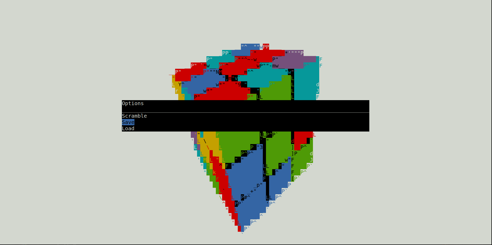

# rubiks_cube
A rubik's cube that runs in your terminal!



## Compilation:

### Depedencies: ncurses or curses

Use
```
make
```
to build on Linux.

On Windows, compilation can be done using a port of curses for Windows such as [pdcurses](https://pdcurses.org/).

To install, use
```
make install
```
Which will install the binary to /usr/bin by default and the license to /usr/share/licenses/rubiks_cube/LICENSE.

## How to Use:
Start the application in a terminal. Make sure that the terminal is the correct size before starting the application, as you cannot resize the terminal during runtime as of now.
### Controls
- Press Left, Right, Up, Down, z, or Z to orient the cube
  - Left and Right rotate the cube around the y axis.
  - Up and Down rotate the cube around the x axis.
  - z and Z rotate the cube around the z axis.
- Press f/F, b/B, l/L, r/R, u/U, or d/D to turn a face
  - f is forward, b back, l left, r right, u up, d down. Pressing Shift-face, ie F, B, L, R, U, or D will turn the face clockwise instead of counterclockwise.
- Press m to access the menu
  - The menu allows you to scramble the cube, save, load, or quit
  - An empty seed to the cube scrambler sets the seed to a random seed.

### Feedback is welcome!

### Possible upcoming features
- The ability to use any nxn cube
- An automatic, efficient solver
